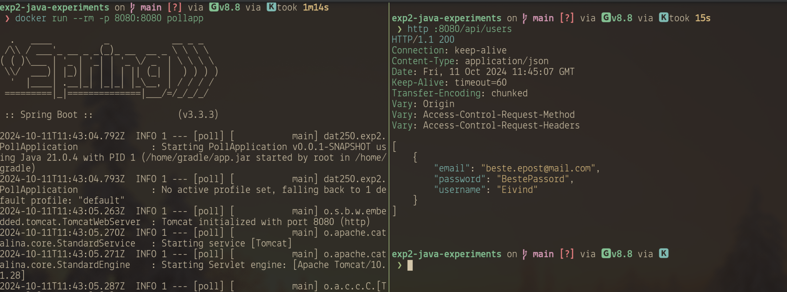

# Technical problems

## Part 1

There was a restriction that the new user, `jpa_client`, was not privileged to use the
database tables. I had to run this on the database to give enough permissions for the tests to pass:
```sql
-- create the user
CREATE USER jpa_client WITH PASSWORD 'secret';
-- Grant basic usage privileges
GRANT USAGE ON SCHEMA public TO jpa_client;

-- This works
GRANT SELECT, INSERT, UPDATE, DELETE ON ALL TABLES IN SCHEMA public TO jpa_client;
-- I tried to use this instead, and it does not work, why?
GRANT ALL PRIVILEGES ON ALL TABLES IN SCHEMA public TO jpa_client;
```

# My solution

## Part 1 - Running postgres image

I created the directory [database](./database), in which I made a setup script
for the docker run command to start the database. The directory also contains
[init-db.sql](./database/init-db.sql), which is the sql that is copied into the database to populate
it and create the user `jpa_client`.

To start the database, simply `cd` into the `database` directory and source the
init file.
```bash
source init-db.sh
```
It is important to be in the correct working directory, as the path specified
to insert the sql into the container uses a relative file path.

## Part 2 - Making an image

I made a dockerfile that you can find here: [Dockerfile](https://github.com/EivindSul/dat250-expass2/Dockerfile)
It compiles and runs the backend in the expass2 assignment, but does not host the frontend properly.
I had issues with the build process when working on expass3, so the frontend was built manually.

Here is a picture of it running in a container, with me testing the API:


# Pending issues

## Part 1

While checking the standard error of the test runs, I found that there
are multiple warnings associated with trying to alter the database tables.
I don't know whether these errors occur from the database being set up the
wrong way, if there are errors in the tests, or if there are errors in the
JPA setup. (persistence.xml)?

One such warning from running the credit cards test:
```
Oct 09, 2024 12:47:11 PM org.hibernate.tool.schema.internal.ExceptionHandlerLoggedImpl handleException
WARN: GenerationTarget encountered exception accepting command : Error executing DDL "
    alter table if exists Address_Customer 
       drop constraint if exists FKcf043iqwi8cd0vqbceaodwce4" via JDBC [ERROR: must be owner of table address_customer]
```
